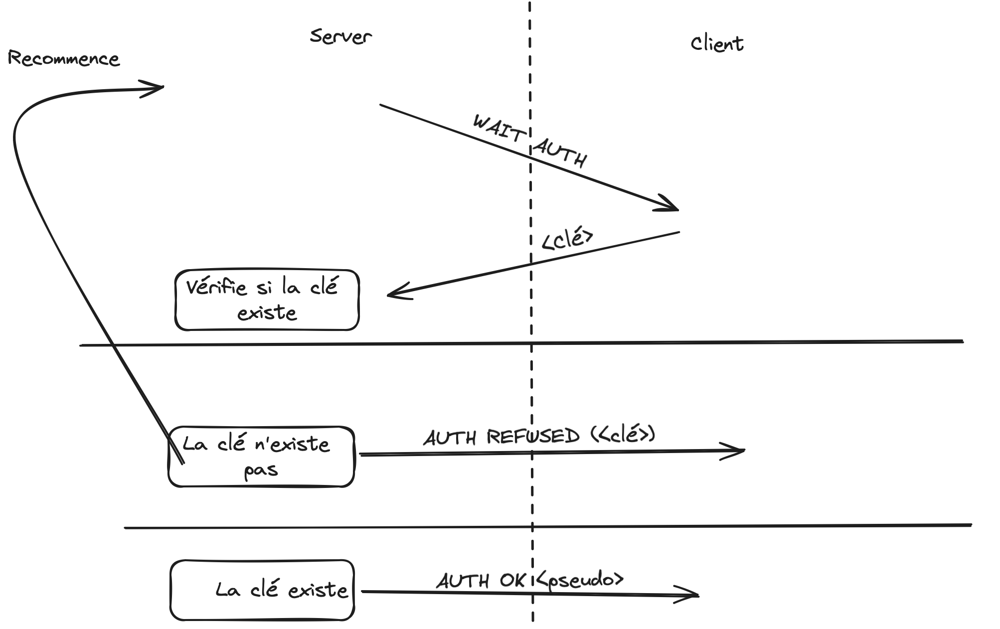
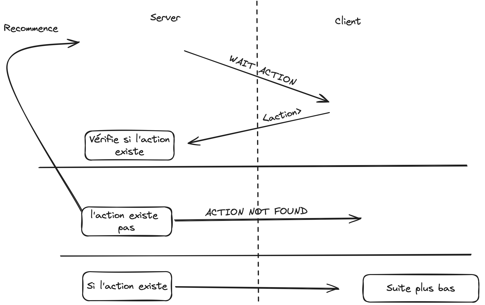

# Synkronizator

Synkronizator est une application serveur en C conçue pour gérer la disponibilité des propriétés pour la plateforme ALHaIZ Breizh.

## Installation de GCC

Si `gcc` n'est pas installé, installez le via :

```bash
sudo su
apt-get update
apt-get install build-essential
```

La librairie `postgresql` **DOIT** être installé, consultez [ce lien](https://www.postgresql.org/) ou executer la commande suivante :

```bash
apt-get install libpq-dev
```

## Installation du Serveur

Après avoir installer les fichiers du Synkronizator (synkronizator.c et .env.template notamment), placez vous dans le dossier les contenants.

```bash
cd nom_repertoire
```

### Configuration .env

En partant du `.env.template` créer un fichier `.env`, en remplissant le fichier `.env` avec vos informations.

### Compilation

Pour compiler le serveur , utilisez la commande suivante :

```bash
gcc -o synkronizator synkronizator.c -lpq
```

Si la librairie `postgresql` est installé à un chemin spécifique utilisez les options `-I` et `-L`.

Exemple (MacOS) :

```bash
gcc -o synkronizator synkronizator.c -Wall -I /opt/homebrew/Cellar/postgresql@14/14.12/include/postgresql@14 -L /opt/homebrew/opt/libpq/lib -lpq
```

Ajouter les droits d'exécution au programme obtenu.

```bash
chmod +rx ./synkronizator
```

### Lancement du Serveur

Pour lancer le serveur :

```bash
./synkronizator --port <numéro_de_port> [options]
```

#### Liste des options disponibles

- --port <numéro> : Définit le port d'écoute (obligatoire)
- --help : Affiche l'aide et quitte le programme
- --verbose : Active le mode verbeux (logs détaillés)
- --log <fichier> : Spécifie le fichier de log (par défaut : application.log)

Le mode `--verbose` ajoute les logs au fichier, celui-ci n'est pas remis à zéro lors de l'ouverture.

## Protocole

Explication du protocole utilisé par le Synkronizator.
Celui-ci se déroule en différentes phases :

### Authentification

1. Le serveur demande la clé API de l'utilisateur, il envoie `WAIT AUTH` au client.
2. Le client envoie une `clé API`.
3. Si la clé API est valide, le serveur répond `Hello, <pseudo>`



### Action globale

1. Le serveur demande une action de l'utilisateur, il envoie `WAIT ACTION` au client.
2. Le client envoie son action (commande).
3. Si l'action existe, on tente de l'executer (voir plus bas).
4. Si l'action est inexistante, le serveur envoie `ACTION NOT FOUND`.



### Liste des actions

`LIST_ALL`

Liste tous les logements accessibles par l'utilisateur.

Requête : `LIST_ALL`
Réponse : Liste des logements au format JSON

Exemple:

```bash
LIST_ALL
```

```JSON
[{"id": 1, "titre": "Maison en bord de mer"}, {"id": 2, "titre": "Appartement centre-ville"}]
```

- `id`: Identifiant du logement.
- `titre`: Titre du logement.

---

`GET_PLANNING`

Récupère le planning de disponibilité d'un logement.

Requête : `GET_PLANNING <ID> <DEBUT> [FIN]`

`<ID>` : Identifiant du logement

`<DEBUT>` : Date de début (format YYYY-MM-DD)

`[FIN]` : Date de fin optionnelle (format YYYY-MM-DD)

Réponse : Planning au format JSON

Exemple:

```bash
GET_PLANNING 1 2024-07-01 2024-08-01
```

```JSON
[{"debut": "2024-07-01", "fin": "2024-07-07"}, {"debut": "2024-07-15", "fin": "2024-07-22"}]
```

- Liste de tout les réservations d'un logement dans une période donnée.
- `debut`: Date de début de la réservation.
- `fin`: Date de fin de la réservation.

---

`SET_AVAILABILITY`

Définit la disponibilité d'un logement.

Requête : `SET_AVAILABILITY <ID> <0/1>`

<ID> : Identifiant du logement
<0/1> : 0 pour indisponible, 1 pour disponible

Réponse : Confirmation au format JSON avec le nouveau statut

Exemple:

```bash
SET_AVAILABILITY 1 0
```

```JSON
[{"id": "1", "status": "f"}]
```

- `id`: Identifiant du logement modifié.
- `status`: Nouveau status du logement (`f` pour hors ligne et `t` pour en ligne)

---

`HELP`

Affiche l'aide sur les commandes disponibles.

Requête : `HELP`

Réponse : Liste des commandes et leur description

---

`QUIT`

Termine la session et ferme la connexion.

Requête : `QUIT`
Réponse : Aucune (la connexion est fermée)

## Gestion des permissions

Le serveur gère les permissions des utilisateurs en fonction de la clé API utilisé.
La configuration des clés ce fait via le site internet dans la page de consultation / modification d'un compte propriétaire.

## Client

Un client est mis à votre disposition pour tester le server.

Il n'est pas obligatoire de passer par lui, vous pouvez très bien utiliser `telnet`.

Pour compiler le client , utilisez la commande suivante :

```bash
gcc -o client client.c
```

Ajouter les droits d'exécution au programme obtenu.

```bash
chmod +rx ./client
```

Puis pour l'executer :

```bash
./client ip_server port_server
```

Celui-ci affichera les messages renvoyés par le serveur, et vous demandera également les prompts nécessaire.
